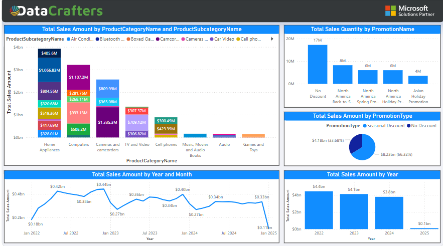
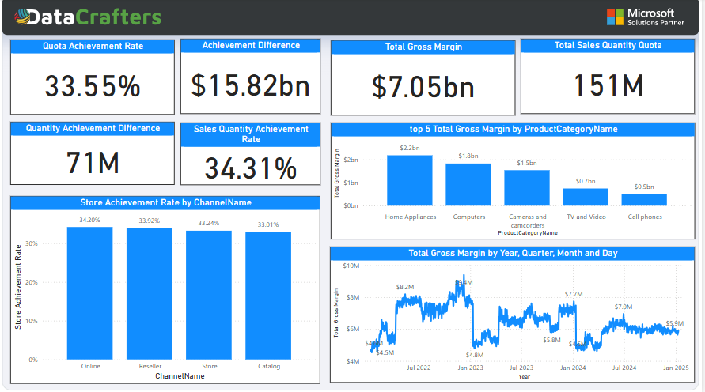
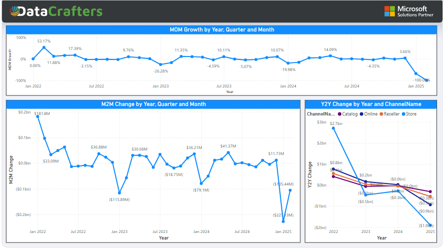

# Contoso Sales Analysis

This Power BI report provides comprehensive insights into Contoso's sales performance, customer behavior, and key business metrics.

## 📊 Report Overview
The report is organized into multiple sections to deliver actionable insights:

### 1. **Sales Analysis**
- Visualizes total sales, revenue trends, and sales distribution.
- Identifies peak sales periods and key contributing factors.
- 

### 2. **KPI Dashboard**
- Displays key performance indicators (KPIs) such as total revenue, profit, and order trends.
- Offers a quick overview of business performance.
- 

### 3. **Achievement Tracking**
- Highlights milestones and progress toward sales goals.
- Provides a clear visual summary of key achievements.
- 

### 4. **Hierarchy Visualization**
- Visualizes organizational structures or category breakdowns.
- Enables deeper analysis across multiple dimensions.
- 

### 5. **Trend Analysis**
- Identifies sales patterns, growth trends, and seasonal impacts.
- Supports forecasting and strategic planning.
- 

## 🔧 Tools & Technologies Used
- **Power BI** for data visualization and insights.
- **SQL** for data preparation and transformation.
- **DAX** for calculated metrics and KPIs.
- **Excel** for data cleaning and organization.

## 📈 Key Insights
- Identified top-performing products and regions.
- Provided actionable insights for improving sales strategies.
- Enabled data-driven decision-making through visual storytelling.

## 🚀 How to Use
1. Clone this repository to your local machine:
   ```bash
   git clone https://github.com/Juwel2121/ContosoSalesAnalysis.git
